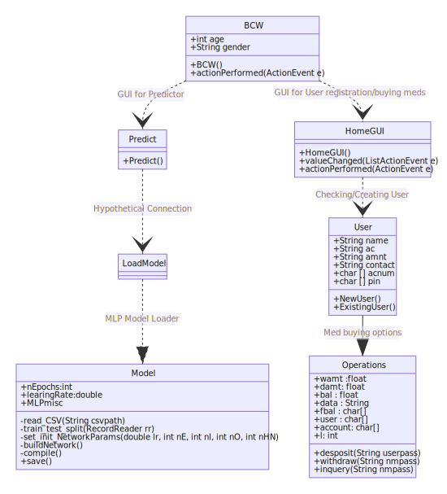

# Hospital Management Project in Java with Deep Learning
<!-- ALL-CONTRIBUTORS-BADGE:START - Do not remove or modify this section -->

<!-- ALL-CONTRIBUTORS-BADGE:END -->

# Features
 A hospital management system with following features :
 - Enabling users to create user account and store User login id ,credentials.
- Validate existing user's using generated  login-id and user pin.
- Store and maintain balance .Options to 
 -Deposit money into hospital account.
- Buy medicines and reflect the necessary balance.
- Choose from variety of medicines for your needs.
- Enquire hospital account balance and exit/continue.

 *Incomplete*:A deep-learning model trained to help doctors in breast cancer prognosis by entering patient information.
# Class Diagram

## Specifications:
- GUI using AWT and Swing framework.
- Neural Network(MLP) trained using DeepLearning4J library.
## Note: 
- *Hypothetical Connection*: Incomplete connection
- Assuming *BreastCancer.java* -> *Model.java* for simplicity.
## References
- https://deeplearning4j.org/
- https://www.oracle.com/technical-resources/articles/javase/swingappfr.html
## Contributors ✨

Thanks goes to these wonderful people ([emoji key](https://allcontributors.org/docs/en/emoji-key)):

<!-- ALL-CONTRIBUTORS-LIST:START - Do not remove or modify this section -->
<!-- prettier-ignore-start -->
<!-- markdownlint-disable -->
<table>
  <tr>
    <td align="center"><a href="https://github.com/imchayan1999"> <b>Chayan Sharma</b></a> <a href="#projectManagement-imchayan1999" title="Project Management">📆</a></td>
  </tr>
</table>

<!-- markdownlint-enable -->
<!-- prettier-ignore-end -->
<!-- ALL-CONTRIBUTORS-LIST:END -->

This project follows the [all-contributors](https://github.com/all-contributors/all-contributors) specification. Contributions of any kind welcome!
